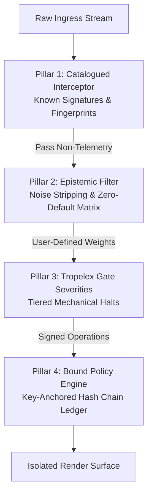

# Sovereign Mirror Architecture Specification

## Thesis Statement
The Sovereign Mirror is a non-moral, procedural computing interface engineered to structurally isolate and safeguard human cognitive focus. It does not possess, simulate, or exercise moral judgment, nor does it claim unconditioned semantic neutrality. Recognizing that semantic classification is inherently probabilistic rather than absolute, the system functions as a transparent, graded bounding box—executing localized filters and real-time gate severities to insulate human agency from known, catalogued vectors of telemetry exploitation and information manipulation.

---

## Core Pillars

### 1. Catalogued Focus-Isolation (Known-Pattern Interception)
* **Mechanic:** Deterministic signature database and heuristic blocking framework.
* **Scope Boundary:** This layer functions strictly as a localized network proxy targeting explicit, known telemetry outlays and fingerprinting techniques. It does not provide comprehensive semantic "anti-instrumentalization"; novel, uncatalogued tracking or extraction vectors will bypass this filter until signatures are manually or cryptographically updated.

### 2. The Epistemic Filter (Information Demarcation)
* **Mechanic:** Structural reduction via the Minimization of Non-Informational Syntax.
* **Value-Neutral Standard:** The system automatically strips non-evaluative structural noise (recommendation wrappers, tracking tokens, infinite-scroll tags).
* **Linguistic Policy:** The system ships with **zero default weights** for semantic or "sensational" text classification. All evaluative thresholds on content parameters are completely unconfigured at design-time; the system remains procedurally inert until the human node explicitly defines and signs a token weights profile.

### 3. Decoupled Gate Severities (Procedural Constraints)
* **Mechanic:** Non-moralized runtime execution exceptions.
* **Alignment:** Directly inherited from the shipped Tropelex Gate Policy taxonomy. Interventions are flagged strictly as mechanical boundary exceptions (Gate Severities), completely divorced from moral rightness or wrongness. The system halts execution to preserve state, leaving evaluative judgment entirely to the user.

### 4. Bound Policy Architecture (Tamper-Evident Session Tracking)
* **Mechanic:** Split runtime/configuration execution anchored to a private key hash chain.
* **The Execution Split:** Real-time defensive actions operate autonomously under a deterministic rule book pre-authorized by the user's initial cryptographic configuration. Structural updates to the rule book, systemic prompts, or filtering weights require a live, runtime cryptographic signature from the user's private key.
* **Audit Trail:** All system state alterations, exceptions, and runtime trips are appended to a localized Tamper-Evident Decision History, ensuring any post-facto modification of system logs is immediately visible upon manual audit.
