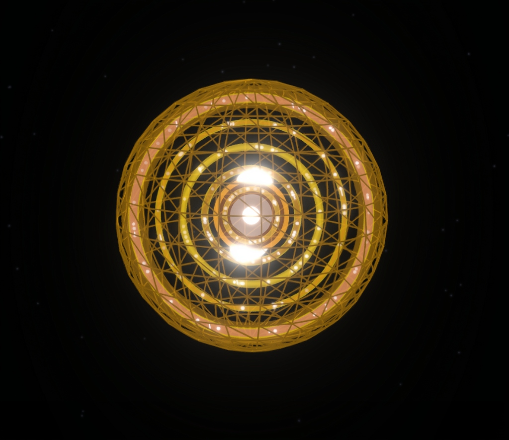

# Sovereign Mirror

<p align="center">
  <a href="https://kylosarc.github.io/Sovereign_Mirror/"></a>
  <a href="api-reference.html"></a>
  <a href="getting-started.html"></a>
  <a href="faq.html"></a>
</p>

<p align="center">
  
  
  
  
  
  
  
  
</p>

---

<p align="center">
  
</p>

> [!NOTE]
> **KYLOS ARC // COGNOSCENTAE ULTRANS — SOVEREIGN MIRROR**  
> A distributed governance simulator built on **Radical Veracity** — visualizing veracity scores, P-Gate confirmations, and node physicalization in real time.
>
> 🌐 **Live Demo Node**: [http://178.156.135.222](http://178.156.135.222)  
> 🔗 **Project Portal**: [kylosarc.com/sovereign-mirror](https://kylosarc.com/sovereign-mirror)  
> 📦 **GitHub Repository**: [github.com/kylosarc/Sovereign_Mirror](https://github.com/kylosarc/Sovereign_Mirror)

---

## What Is the Sovereign Mirror?

A **sovereign** is a person or entity that holds supreme, ultimate authority. Kylos Arc asserts that every person — every node — has an inherent right to sovereignty without exception.

The **Sovereign Mirror** is a living, animated dashboard and simulation of a digital governance system with **no centralized control**. Sovereignty is distributed across every node in the network via a golden-ratio (`0.618`) toroidal mesh pattern that preserves dynamic equilibrium.

In plain terms: **Imagine a town hall where everyone votes simultaneously, the vote is tallied automatically by pure mathematics, and no single entity can manipulate the outcome.**

---

## Visualizing the Network: Particle States

Each particle on the 3D canvas represents an active node in the distributed governance mesh. Color reveals real-time consensus conditions:

| Particle Glow | State | Description |
| :--- | :--- | :--- |
| 🔵 **Cyan / Teal Glow** | **Active** | Healthy governance — nodes are voting and reaching mathematical consensus. |
| 🟠 **Yellow / Orange** | **Sync** | The network is coordinating — nodes are synchronizing P-Gate validation cycles. |
| 🔴 **Red / White** | **Dumbbell Fission** | High-stress state — the network is undergoing entropy divergence or adversarial pressure. |
| ⚪ **Dim / Gray** | **Standby** | Dormant mode — the system is at rest, awaiting ingress proposals. |

### The 15-Second Simulation Loop

Every 15 seconds, the system cycles through four governance stages:
`01 ACTIVE` ➔ `02 SYNC` ➔ `03 FISSION` ➔ `04 STANDBY` ➔ cycles back to `01 ACTIVE`.

---

## The Five Mandatory Logic Gates

Every governance decision in Sovereign Mirror passes through five pure functions (zero side effects, zero hidden state):

```
┌─────────────────────────────────────────────────────────────────────────────┐
│ 1. Veracity Gate:       max(0, V_active - V_control)                        │
│    • Only net-positive truth advances the system.                           │
├─────────────────────────────────────────────────────────────────────────────┤
│ 2. P-Gate:              7-cycle confirmation · Quorum = √N + 2              │
│    • Requires broad multi-cycle consensus before physicalization.           │
├─────────────────────────────────────────────────────────────────────────────┤
│ 3. Inverion Divide:     Remediate, not delete                               │
│    • Deprecated nodes are preserved in an auditable historical state.       │
├─────────────────────────────────────────────────────────────────────────────┤
│ 4. Abolition of Pain:   pain ≥ threshold → Triggered                        │
│    • Enforces an inviolable pain-free operating floor for every node.       │
├─────────────────────────────────────────────────────────────────────────────┤
│ 5. Atrophy Timer:       T_limit = 86,400,000 ms (24h)                       │
│    • Inactive nodes are automatically flagged for peer review.              │
└─────────────────────────────────────────────────────────────────────────────┘
```

---

## Radical Veracity & Post-Quantum Cryptographic Verification

The Sovereign Mirror utilizes a mathematical, value-neutral architecture to verify state authenticity and isolate focus:

- **Epistemic Demarcation**: Operates on a zero-default token weights matrix (`token-weights-matrix.schema.json`), avoiding prescriptive moral bias.
- **Post-Quantum Cryptography (PQC)**: Kyber-768, Dilithium, and MAYO-1 asymmetric signature exchange for quantum-resistant node authorization.
- **Tamper-Evident Ledger**: Append-only SHA-256 forward-linked session ledger ensuring complete provenance and non-repudiation.

### Inverion State Thresholds

- `< 0.15` — **`OBJECTIVE_REALITY`**: Verified pass.
- `0.15 – 0.60` — **`TRANSITIONAL`**: Subjective or ungrounded; logged to audit trail.
- `≥ 0.60` — **`SUBJECTIVE_NOISE`**: High variance/noise; prompt is intercepted for operator remediation.

---

## Hybrid Three-Tier State Architecture

To sustain 60 FPS in Three.js alongside high-frequency consensus transactions, the state layer is decoupled into three dedicated tiers:

```
                  ┌─────────────────────────────────────────┐
                  │          SOVEREIGN MIRROR HUD           │
                  └────────────────────┬────────────────────┘
                                       │
        ┌──────────────────────────────┼──────────────────────────────┐
        ▼                              ▼                              ▼
 ┌──────────────┐               ┌──────────────┐               ┌──────────────┐
 │ ATOMS (Jotai)│               │ HUD (Zustand)│               │LEDGER (Redux)│
 ├──────────────┤               ├──────────────┤               ├──────────────┤
 │ Per-node     │               │ Global HUD   │               │ Immutable    │
 │ reactive     │               │ telemetry    │               │ audit trail  │
 │ state (pGate │               │ (flux, noise │               │ (veracity log│
 │ cycles, pos) │               │ temp, tick)  │               │ & events)    │
 └──────────────┘               └──────────────┘               └──────────────┘
```

---

## Real-Time NOAA Solar Wind Integration

Real-time space weather data from the **NOAA Space Weather Prediction Center** (SWPC) feeds directly into the simulation kernel, driving particle velocity, plasma density, and chromatic perturbation in the 3D canvas based on solar wind flux.

---

## Key Mathematical Constants

| Constant | Value | Role |
| :--- | :--- | :--- |
| `GOLDEN_RATIO` | `0.6180339887` | Toroidal mesh node spacing and harmonic distribution |
| `CONFIRMATION_CYCLES` | `7` | Required consecutive P-Gate cycles for state physicalization |
| `BASE_TICK_RATE` | `400ms` | Baseline network heartbeat frequency |
| `MAX_NODES` | `100` | Baseline local simulation node capacity |
| `THRESHOLD_ENTROPY` | `±7.0%` | Maximum allowable variance before triggering Inverion divide |

---

## Quickstart

```bash
# Clone repository
git clone https://github.com/kylosarc/Sovereign_Mirror.git
cd Sovereign_Mirror

# Install dependencies
npm install
pip install -r requirements.txt

# Start local dev server
npm run dev
```

Visit `http://localhost:5173` to explore the live dashboard.

---

## License & Governance

Licensed under the MIT License. Developed by **Kylos Arc // Cognoscentae Ultrans**.
