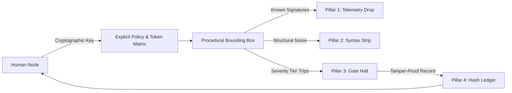

# SAFETY.md - Sovereign Mirror & Tropelex Convergence

## Purpose & Scope
This document outlines the safety architecture and procedural constraints for **Sovereign Mirror** and its structural convergence with **Tropelex**.

Neither system functions as an autonomous moral authority. The architecture strictly decouples mechanical execution limits from moralizing value judgments.

---

## 1. Architectural Convergence Axioms

1. **Non-Moral Computing Interface:** The system does not claim or simulate ethical discernment. 
2. **Probabilistic Semantics:** Linguistic analysis is recognized as inherently probabilistic and graded, requiring operator-defined matrices rather than hardcoded moral thresholds.
3. **Mechanical Gate Severities:** All interventions are executed as deterministic state halts (exceptions), leaving agency entirely with the human operator.
4. **Cryptographic Binding:** Policy changes require offline private-key authorization; runtime defensiveness executes within pre-authorized boundaries.

---

## 2. Tropelex Gate Severity Matrix

| Gate Level | Identifier | System Action | Behavioral Boundary |
| :--- | :--- | :--- | :--- |
| **Tier 0** | `GATE_PASS` | Unimpeded execution | Payload passes without alteration; session hash appended. |
| **Tier 1** | `GATE_INFO_DEMARCATE` | Non-informational syntax strip | Telemetry tokens, tracking pixels, and infinite scroll wrappers stripped. |
| **Tier 2** | `GATE_HALT_EVAL` | Execution pause on operator token match | State paused. Mechanical diff presented to operator for bypass/continue decision. |
| **Tier 3** | `GATE_STATE_FREEZE` | Policy mutation halt | Unsigned or tampered policy alterations immediately freeze execution until key verification. |

---

## 3. Cryptographic Audit Integrity
Every gate trip, policy reload, and telemetry demarcation is recorded to an append-only SHA-256 hash chain:

$$\text{Block}_n = \text{SHA256}(\text{Index} \parallel \text{Timestamp} \parallel \text{PrevHash} \parallel \text{Payload} \parallel \text{GateTier})$$

Any post-facto modification invalidates the chain head, ensuring instantaneous audit visibility.
